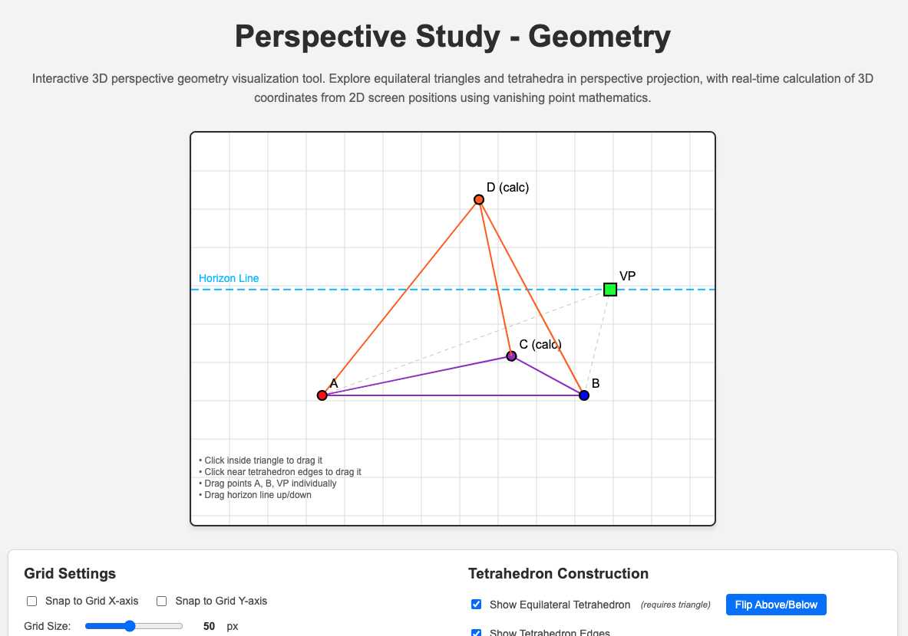

# Perspective Study - Geometry

[](https://tpabarbosa.github.io/perspective-for-geometry/)
[](https://tpabarbosa.github.io/perspective-for-geometry/)
[](https://opensource.org/licenses/MIT)

> Interactive geometry tool for learning perspective drawing principles

## 🎯 [Try it Live!](https://tpabarbosa.github.io/perspective-for-geometry/)



Learn perspective drawing through interactive geometry. Drag points to create equilateral triangles and tetrahedra that maintain their 3D proportions in perspective view, complete with construction lines and mathematical verification.

## ✨ Features

- 🎨 **Interactive Canvas** - Drag points, triangles, and geometric shapes
- 📐 **Perspective Geometry** - Real-time equilateral triangle construction in perspective
- 🎲 **3D Visualization** - Tetrahedron with proper perspective projection
- 🔢 **Mathematical Verification** - Live distance calculations and validation
- 📏 **Construction Lines** - Show geometric construction and circumcircles
- 📱 **Mobile Friendly** - Touch support for tablets and phones
- ⚙️ **Customizable** - Grid snapping, coordinate display, and visual options
- ⌨️ **Keyboard Shortcuts** - Quick access to common functions

## 🚀 Quick Start

**[Open Live Demo](https://tpabarbosa.github.io/perspective-for-geometry/)** or run locally:

```bash
git clone https://github.com/tpabarbosa/perspective-for-geometry.git
cd perspective-for-geometry
# Open index.html in your browser or use Live Server
```

No build process required - just open `index.html` in any modern browser!

## 🎮 How to Use

1. **[Open the app](https://tpabarbosa.github.io/perspective-for-geometry/)**
2. **Drag the red and blue points (A & B)** to position your triangle base
3. **Move the green vanishing point (VP)** to change perspective angle
4. **Drag the horizon line** up/down to adjust eye level
5. **Enable triangle and tetrahedron** using the checkboxes
6. **Use controls** to show construction lines, circumcircles, and measurements

### Interactive Elements

- **Points A & B**: Base points of the equilateral triangle
- **Vanishing Point (VP)**: Controls perspective convergence
- **Horizon Line**: Adjusts viewer's eye level
- **Triangle**: Drag the entire triangle when enabled
- **Tetrahedron**: Drag the entire 3D shape when enabled

### Controls Panel

- **Grid Settings**: Snap to grid, adjust size, show coordinates
- **Triangle Options**: Construction lines, circumcircle, dragging
- **Tetrahedron Options**: Edge visibility, positioning, dragging
- **Real-time Info**: Distance measurements in both 2D and 3D

### Keyboard Shortcuts

- `X` - Toggle X-axis grid snapping
- `Y` - Toggle Y-axis grid snapping
- `G` - Toggle grid visibility
- `C` - Toggle coordinate display
- `+/-` - Adjust grid size

## 📚 Educational Value

This tool demonstrates key concepts in perspective drawing and geometry:

- **Perspective Projection**: How 3D objects appear on a 2D surface
- **Vanishing Points**: How parallel lines converge in perspective
- **Horizon Line**: The viewer's eye level and its effect on perspective
- **Equilateral Triangles**: Maintaining equal sides in perspective view
- **3D Geometry**: How tetrahedra project onto the picture plane
- **Mathematical Relationships**: Distance calculations in 2D vs 3D space

Perfect for:
- 🎨 Art students learning perspective drawing
- 👩‍🏫 Teachers demonstrating geometric principles
- 📐 Anyone interested in the mathematics of perspective
- 🎓 Students studying technical drawing or computer graphics

## 🛠️ Technology Stack

- **Frontend**: Pure JavaScript (ES6+), HTML5 Canvas, CSS3
- **Architecture**: Modular design with separate renderers and utilities
- **Math Engine**: Custom 3D perspective projection calculations
- **State Management**: Centralized app state with observer pattern
- **Rendering**: Specialized renderers for different geometric elements
- **Deployment**: GitHub Pages (static hosting)

### Project Structure

```
js/
├── math/              # Mathematical utilities
│   ├── Vector3D.js    # 3D vector operations
│   ├── GeometryUtils.js # 2D/3D geometry calculations
│   └── PerspectiveUtils.js # Perspective projection
├── renderers/         # Rendering system
│   ├── BaseRenderer.js
│   ├── PointRenderer.js
│   ├── TriangleRenderer.js
│   └── ...
├── AppState.js        # State management
├── GeometryApp.js     # Main application
└── main.js           # Entry point
```

## 🎯 Key Features Explained

### Perspective-Correct Geometry
The app calculates true 3D coordinates and projects them onto the 2D canvas, ensuring that:
- Triangles remain equilateral in 3D space
- Tetrahedra maintain proper proportions
- Distance measurements are mathematically accurate

### Interactive Learning
- **Visual Feedback**: See how moving elements affects the entire construction
- **Real-time Calculations**: Watch measurements update as you drag
- **Construction Lines**: Understand the geometric relationships
- **Multiple Views**: Toggle different visual aids to understand the math

### Mathematical Accuracy
- Uses proper perspective projection formulas
- Calculates true 3D distances vs. apparent 2D distances
- Validates geometric relationships in real-time
- Shows circumcircles and construction geometry

## 🤝 Contributing

Contributions are welcome! This project is great for:
- Adding new geometric shapes
- Improving the mathematical calculations
- Enhancing the user interface
- Adding educational features

```bash
# Fork the repository
git clone https://github.com/tpabarbosa/perspective-for-geometry.git
cd perspective-for-geometry
# Make your changes
# Open index.html to test
# Submit a pull request
```


## 🔗 Links

- **[Live Demo](https://tpabarbosa.github.io/perspective-for-geometry/)** - Try it now!
- **[Source Code](https://github.com/tpabarbosa/perspective-for-geometry)** - View on GitHub
- **[Issues](https://github.com/tpabarbosa/perspective-for-geometry/issues)** - Report bugs or request features

---

**[🎯 Launch the App →](https://tpabarbosa.github.io/perspective-for-geometry/)**

*Built with ❤️ for students and educators learning perspective drawing*
